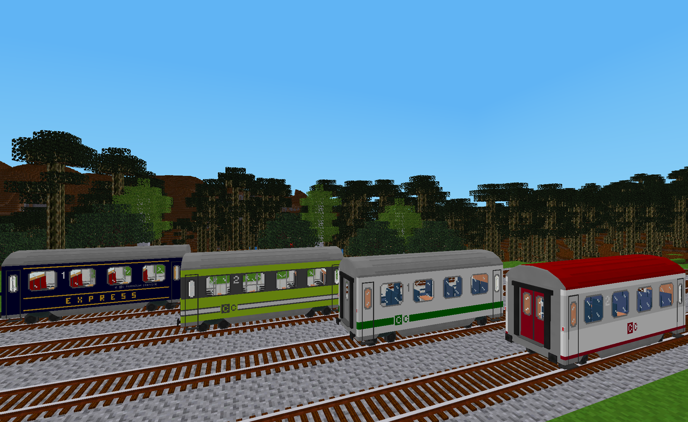

# Classic Coaches

This mod is an extension for [Advanced Trains](https://content.minetest.net/packages/orwell/advtrains/) that adds a set of four intercity style passenger wagons, all of which have liveries that can be customized in-game by their owning players.

## Wagons

All of the wagons in this mod are loosely based on passenger coaches used for European inter city railway service during the late 20th and early 21st centuries.

### Corridor Coach Class 1

This wagon features modern compartment style seating with corridor access to adjoining wagons.  Each compartment contains six extra wide first class airline style seats with a folding center table and stylish overhead shelving.

The wagon is modeled with 24 seats.  Up to 4 players can board each wagon.

### Corridor Coach Class 2

This wagon also features modern compartment style seating with corridor access to adjoining wagons.  Each compartment contains six standard second class airline style seats with a folding center table, two small side tables and standard overhead shelving. 

The wagon is modeled with 24 seats.  Up to 4 players can board each wagon.

### Open Coach Class 1

This wagon features modern open plan style seating with vestibule access to adjoining wagons.  Each row contains three extra wide first class airline style seats.  Stylish overhead shelving is located along both sides of the wagon.

The wagon is modeled with 18 seats.  Up to 3 players can board each wagon.

### Open Coach Class 2

This wagon also features modern open plan style seating with vestibule access to adjoining wagons.  Each row contains four standard second class airline style seats.  Standard overhead shelving is located along both sides of the wagon.

The wagon is modeled with 32 seats.  Up to 5 players can board each wagon.

## Livery Customization

Like some other mods for **Advanced Trains**, this mod supports using the bike painter tool from the [bike mod](https://content.minetest.net/packages/Hume2/bike/) to allow players to paint portions of their wagons a custom color.

In addition to using the bike painter to change a color, this mod also allows players to use the bike painter tool to alter the appearance of their wagons  more significantly by selecting a different livery template.  These templates   each have a different texture and a different area of the wagon that is affected when colorized by the painter.

Because of these templates, this mod handles the bike painter tool slightly differently from other mods.  Specifically, the bike painter can also be used to select which livery template is applied to a wagon as well as colorize a portion of it. This is accomplished by using the bike painter tool's "alpha" value to select a livery template instead of a transparency level. Valid alpha values can range from 0 to 6.  Alpha values greater than 6 cause the bike painter to have no effect.

The bike painter tool's RGB value otherwise works as usual to define a custom color.  However, an RGB value of #000000 has a special meaning in that instead of setting the color to black, it resets the color to its default value.  (Consider using color "#010000", "#010101" or something similar for black if needed.)

#### Examples:

Bike Painter Value|Result
---|---
#000000**00**|Applies livery template #00 with its default colors
#000000**01**|Applies livery template #01 with its default colors
#FF0000**02**|Applies livery template #02 and colors a portion of it red 
#00FF00**03**|Applies livery template #03 and colors a portion of it green 
#00092B**07**|No effect due to livery template #07 not being defined.

## Author's Notes

1) These wagon models are the same ones that I created earlier in 2022 with the intention of adding them to the [Moretrains](https://content.minetest.net/packages/gpcf/moretrains/) mod pack.  However, with multiple variations of the Moretrains modpack currently in use, I have decided to release these wagons separately in this mod for easier distribution and to use them for showcasing new livery customization functionality.  Both the liveries and the crafting recipes in this mod are different from the those that I created for Moretrains so they won't conflict with one another if used in the same game.

## Licenses

Copyright © 2022 Marnack

- Classic Coaches code is licensed under the GNU AGPL version 3 license, see [LICENSE.txt](LICENSE.txt) for details.
- Unless otherwise specified, Classic Coaches media (models, textures, images  and sounds) are licensed under [CC BY-SA 3.0 Unported](https://creativecommons.org/licenses/by-sa/3.0/).

### Attributions

The following items from prior art were included in whole or in part in this mod:

- From the mod for Minetest named "moretrains_basic" in the "minetest-moretrains" modpack:
	- Models and textures for the bogie, wheels and buffers (CC BY-SA 3.0 by rbduck)

- From the mod for Minetest named "advtrains_train_jre231" in the "JR_E231series_modpack" modpack:
	- Portions of the code to support livery customization via the bike painter tool (LGPL 2.1 by Mainote plants lab).
